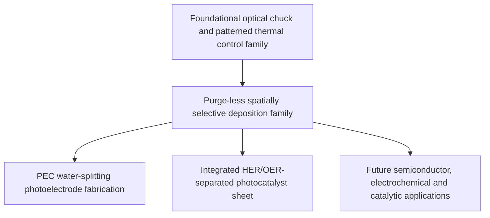

# Patent Portfolio Map

## Cools Purge-Less Optical ALD Platform

This document organizes the disclosed patent-filed technology into its platform layer and two representative water-splitting product layers.

[English Overview](README.md) · [한국어](README_KR.md) · [中文](README_ZH.md)

---

## Portfolio thesis

The portfolio does not begin with a photocatalyst sheet.

Its foundational concept is a new reaction-control architecture for Atomic Layer Deposition (ALD):

> **Two or more precursors coexist in a low-temperature gas phase, while only an optically selected working surface is pulsed into a self-limited reaction window.**

The conventional purge sequence is replaced by:

- gas-phase / surface-temperature separation;
- patterned optical activation;
- chemisorption saturation; and
- pulse-off reaction termination.

The disclosed water-splitting filings are application branches built on this deposition platform.

---

## Patent-family hierarchy



The two disclosed specifications state that they form the same rights family as earlier filings concerning:

1. an optically transparent electrostatic chuck and optical-pattern-based wafer adsorption / temperature control; and
2. a spatially selective deposition apparatus and purge-less thin-film formation method using the optically transparent chuck.

Those upstream inventions are not reproduced here in full, but they define the common equipment and process foundation.

---

# P01 — Purge-Less ALD for PEC Water-Splitting Photoelectrodes

## Filing title

**Method for Fabricating a Photoelectrochemical Water-Splitting Photoelectrode Using Purge-less Atomic Layer Deposition Based on Simultaneous Precursor Supply and Working-Surface Light-Pulse Gating, and the Photoelectrode**

## Primary role

Platform-to-product bridge filing covering purge-less ALD fabrication of:

- photocorrosion-protection layers;
- water-splitting cocatalysts;
- spatially separated HER/OER cocatalyst regions; and
- resulting Photoelectrochemical (PEC) electrodes.

## Core process elements

1. simultaneous supply of first and second precursor gases without temporal separation;
2. omission of chamber purge, inert-gas purge or precursor-removal steps between exposures;
3. maintenance of the shared gas phase at a temperature suppressing gas-phase reaction, homogeneous nucleation and non-self-limited deposition;
4. transmission of a light pulse through an optically transparent chuck and through gaps between support protrusions;
5. selective absorption at the working surface or an absorption layer on the working surface;
6. local entry of the working surface into a self-limited surface-reaction temperature window;
7. chemisorption saturation limiting growth during each light pulse; and
8. reaction termination through pulse-off cooling below the surface-reaction threshold.

## Product elements

- semiconductor light absorber;
- pinhole-suppressed photocorrosion-protection layer;
- HER cocatalyst region;
- OER cocatalyst region;
- mask-free optical-pattern-defined boundary; and
- optional single-surface water-splitting completion without external wiring.

## Representative material space

### Light absorbers

- silicon;
- cadmium telluride;
- copper indium gallium selenide;
- III–V compounds; and
- multijunction combinations.

### Protection layers

- titanium oxide;
- aluminum oxide; and
- hafnium oxide.

### HER cocatalysts

- platinum;
- molybdenum disulfide;
- nickel phosphide; and
- nickel–molybdenum alloy.

### OER cocatalysts

- nickel–iron oxide;
- cobalt oxide;
- cobalt phosphate; and
- iridium oxide.

## Representative engineering windows described in the filing

- gas-phase temperature: approximately 50–150 °C;
- working-surface temperature: approximately 150–400 °C;
- silicon sub-bandgap optical example: approximately 1500 nm;
- microsecond-scale pulse examples; and
- surface reaction rate designed to exceed the gas-phase reaction rate by at least two orders of magnitude in representative conditions.

These values are patent-described implementation windows and examples, not independent validation data.

## Strategic coverage

P01 is important because it prevents the platform from being characterized only as a generic deposition tool. It ties the common process architecture to a commercially relevant need: high-throughput formation of dense protection layers on corrosion-sensitive photoabsorbers.

It also provides a direct route from the deposition process to a completed PEC electrode structure.

---

# P02 — Integrated HER/OER-Separated Photocatalyst Sheet

## Filing title

**Method for Fabricating an Integrated Photocatalyst Sheet Having Spatially Separated Hydrogen-Evolution and Oxygen-Evolution Cocatalysts by Purge-less Atomic Layer Deposition Based on Simultaneous Precursor Supply and Working-Surface Light-Pulse Gating, and the Photocatalyst Sheet**

## Primary role

Product-focused filing covering an integrated photocatalyst sheet in which reduction and oxidation reaction sites are spatially programmed on the same light-absorber surface.

## Core product proposition

```text
Randomly mixed HER/OER sites
→ charge recombination and gas back reaction

Optically programmed HER/OER separation
→ spatially separated reduction and oxidation sites
→ lower recombination and back reaction
```

## Core manufacturing elements

1. simultaneous precursor supply without purge;
2. cold gas-phase reaction suppression;
3. optical pulse heating of a selected working-surface region;
4. self-limited layer formation only in the optically activated region;
5. switching of the optical pattern and precursor set;
6. maskless formation of a first HER cocatalyst region;
7. maskless formation of a second OER cocatalyst region; and
8. formation of a single sheet or particle operating as a complete photocatalytic reaction unit.

## Pattern architecture

The filing includes:

- interdigitated HER/OER regions;
- optical-pattern-defined boundaries without mask residue, inhibitor residue or lift-off steps;
- pattern spacing selected with reference to charge-carrier diffusion length; and
- reconfigurable geometry through emitter-level light control.

## Functional extensions

The same spatial separation of reduction and oxidation regions can be directed to:

- water splitting into hydrogen and oxygen;
- carbon-dioxide reduction;
- hydrogen-peroxide generation; and
- other paired photo-oxidation / photo-reduction reactions.

The product may be fabricated as:

- a panel-type sheet;
- a distributed particle; or
- a powder-format photocatalyst.

## Strategic coverage

P02 protects the downstream product architecture that benefits most directly from spatially programmable deposition.

It is not merely a method claim for placing two catalysts. It links:

- purge-less ALD;
- optical area selection;
- maskless catalyst patterning;
- oxidation / reduction site separation; and
- a complete externally unwired photocatalyst unit.

---

# Shared Equipment and Control Layer

Both disclosed filings rely on a common tool architecture.

## Optical chuck

- optically transparent chuck body;
- support protrusions;
- optical gaps between protrusions;
- backside optical transmission; and
- optional electrostatic holding function.

## Addressable light source

- Vertical-Cavity Surface-Emitting Laser (VCSEL) array or equivalent source;
- emitter-by-emitter intensity control;
- emitter-by-emitter timing control;
- emitter-by-emitter spatial selection; and
- optical pattern rewriting without mechanical mask exchange.

## Chamber

- simultaneous precursor-delivery system;
- cold-wall or otherwise cooled gas-phase environment;
- optical access through the chuck; and
- control system coordinating precursor set, optical pattern, pulse duration and target surface-temperature window.

---

# Claim-Layer Logic

| Layer | Protected subject | Commercial meaning |
|---|---|---|
| Equipment foundation | Transparent chuck, optical source and patterned temperature control | Tool architecture |
| Process foundation | Simultaneous precursors + cold gas + optical surface gating | Purge-less ALD platform |
| PEC application | Protection layer and cocatalyst formation on photoelectrode | Durable water-splitting electrode |
| Spatial catalyst application | HER/OER region separation without mask or inhibitor | Integrated high-efficiency photocatalyst sheet |
| Product structure | Light absorber + protection layer + separated catalyst regions | Saleable device / sheet / particle |
| Expansion layer | Semiconductor, battery, catalyst and functional-surface processes | Cross-industry licensing |

---

# Differentiation Map

## Versus conventional temporal ALD

- precursors are not required to be separated in time;
- purge is not the reaction-termination mechanism;
- the active surface temperature is optically gated; and
- area selectivity can be built into the heat pattern.

## Versus spatial ALD using separated gas zones

- spatial separation is not primarily created by physically isolated precursor zones;
- both precursors may coexist over the same surface;
- reaction localization is created through temperature and optical activation.

## Versus area-selective ALD using inhibitors

- no self-assembled monolayer or inhibitor layer is required to define the non-growth region;
- no inhibitor-removal step is required;
- the pattern can be rewritten electronically.

## Versus photodeposition of randomly distributed cocatalysts

- HER and OER catalyst regions are intentionally separated;
- pattern location and spacing are controllable;
- the boundary is optically defined rather than statistically formed.

## Versus continuous photothermal CVD

- growth is intended to be limited by chemisorption saturation;
- the gas phase is maintained below the continuous reaction window;
- pulse-off cooling terminates the surface reaction; and
- pulse-by-pulse growth saturation is a core verification criterion.

---

# Verification Priorities

The most important technical proof points for the portfolio are:

1. **Gas-phase stability** — no material homogeneous nucleation or continuous particle formation under simultaneous precursor exposure.
2. **Growth saturation** — growth per pulse reaches a surface-saturation plateau rather than scaling continuously with pulse duration.
3. **Pulse-off termination** — film growth stops when the selected surface falls below the reaction threshold even though precursors remain present.
4. **ALD-quality film** — thickness uniformity, conformality, composition and pinhole density approach the target performance of conventional ALD.
5. **Spatial selectivity** — unheated regions remain substantially free of film or show a controllable selectivity ratio.
6. **Pattern fidelity** — optical-pattern geometry is reproduced with a measurable and stable boundary width.
7. **Protection performance** — the deposited layer suppresses photocorrosion during electrolyte exposure.
8. **Reaction-site separation effect** — HER/OER spatial separation reduces carrier recombination and gas back reaction relative to randomly mixed catalysts.

---

# Commercialization Structure

The portfolio supports several transaction models.

## Equipment collaboration

Joint development with ALD, CVD, PEC or laser-processing equipment companies for:

- transparent chuck modules;
- VCSEL patterning heads;
- cold-wall chamber integration;
- precursor-delivery architecture; and
- control software.

## Process licensing

Field-specific licenses for:

- semiconductor passivation;
- battery and electrochemical coatings;
- display and sensor films;
- catalyst patterning;
- PEC electrodes; and
- integrated photocatalyst sheets.

## Product collaboration

Co-development or supply agreements for:

- protected PEC electrodes;
- HER/OER-separated catalyst sheets;
- patterned catalyst particles; and
- other spatially separated oxidation / reduction devices.

---

## Notice

This portfolio map summarizes patent specifications at a public explanatory level. It does not grant rights to practice the inventions and does not disclose all precursor recipes, optical absorption structures, surface treatments, control parameters or equipment know-how.

**Cools Inc.**
