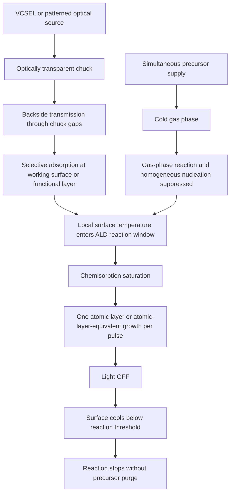
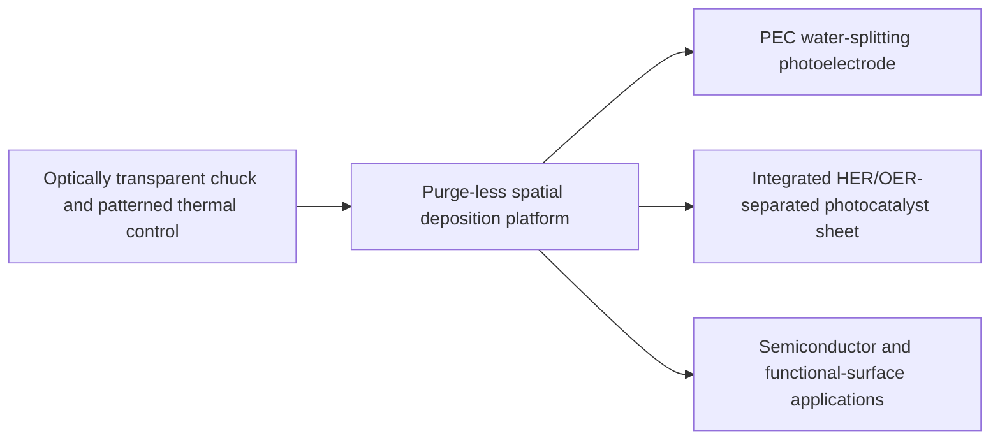

# Cools Purge-Less Optical ALD

## Keep the precursors together. Activate only the surface, only where needed, only when needed.

> **Conventional atomic layer deposition separates precursors in time.**  
> **Cools suppresses reaction in the gas phase and gates the working surface with light pulses.**

[한국어](README_KR.md) · [中文](README_ZH.md) · [Patent Portfolio](PATENT_PORTFOLIO.md)

---

## Executive proposition

Atomic Layer Deposition (ALD) achieves self-limited film growth by repeatedly separating precursor exposures with purge steps. The purge sequence protects the process from gas-phase reaction, but it also occupies much of every cycle and becomes a fundamental throughput bottleneck.

The Cools platform changes the control variable.

Instead of preventing two precursors from coexisting, the platform:

1. supplies two or more precursors simultaneously;
2. keeps the shared gas phase below the temperature at which gas-phase reaction, homogeneous nucleation and non-self-limited deposition become significant;
3. transmits patterned light through an optical chuck;
4. heats only the working surface or an optical absorption layer on that surface;
5. allows chemisorption saturation to limit growth during each light pulse; and
6. terminates the surface reaction by switching the light off and cooling the activated region below its reaction threshold.

The result is a patent-filed architecture for **purge-less, spatially programmable, light-gated surface deposition**.

---

## The industrial contradiction

Conventional ALD needs temporal separation because simultaneously present precursors can react in the gas phase and drift toward Chemical Vapor Deposition (CVD)-like growth.

```text
Precursor A
→ purge
→ Precursor B
→ purge
→ repeat
```

This sequence delivers excellent thickness control and conformality, but the non-deposition time dominates the cycle. In the patent-described architecture, purge can account for approximately 60–80% of a conventional cycle.

Cools replaces temporal precursor separation with three coordinated barriers:

```text
Cold gas phase
+ locally heated working surface
+ optical pulse ON/OFF gating
= reaction only at the selected surface, during the selected time window
```

---

## Core platform architecture



### Control domain 1 — gas-phase suppression

The chamber gas phase is maintained at a temperature where precursor-to-precursor reaction, homogeneous nucleation and continuous non-self-limited deposition are substantially suppressed. A cold-wall chamber can be used to stabilize this condition.

### Control domain 2 — working-surface activation

Light transmitted through the chuck is absorbed at the working surface or at a dedicated absorption layer. Only the selected region enters the temperature window required for surface reaction.

### Control domain 3 — pulse termination

When the light pulse ends, the selected region cools below the reaction threshold. The precursors may remain present, but additional growth is suppressed because the activated surface condition has disappeared.

---

## Why this is not ordinary CVD

The platform is designed so that film formation is not driven by continuous gas-phase reaction products or homogeneous gas-phase nucleation.

Its intended self-limiting mechanism is:

- saturation of available surface reaction sites;
- localization of reaction to the optically heated surface;
- reaction termination through pulse-off cooling; and
- suppression of gas-phase chemistry by maintaining a colder surrounding gas environment.

Accordingly, the architecture seeks to preserve ALD-like surface saturation while removing the conventional purge sequence.

---

## Optical chuck and programmable surface

The deposition tool can use an optically transparent Electrostatic Chuck (ESC) with protrusions supporting the workpiece and optical gaps between the protrusions. A Vertical-Cavity Surface-Emitting Laser (VCSEL) array or another addressable light source is positioned below the chuck.

Each emitter can be controlled by position, timing and intensity.

```text
Full precursor exposure over the entire surface
+ selected optical pixels
= deposition only in selected heated regions
```

This creates a software-defined deposition area without requiring:

- lithographic masks;
- inhibitor layers;
- lift-off processing; or
- permanent hardware masks for each pattern.

The deposition geometry can be changed by rewriting the optical pattern.

---

## Representative water-splitting application

The first application family uses the platform to manufacture Photoelectrochemical (PEC) water-splitting electrodes and integrated photocatalyst sheets.

### 1. High-throughput pinhole-suppressed protection layer

A dense protection layer such as titanium oxide, aluminum oxide or hafnium oxide can be deposited on a semiconductor light absorber to isolate it from the electrolyte and reduce photocorrosion.

The platform targets the conformality and surface saturation of ALD while eliminating purge-dominated cycle time.

### 2. Maskless HER/OER cocatalyst separation

Hydrogen Evolution Reaction (HER) and Oxygen Evolution Reaction (OER) cocatalysts are deposited in different optically selected regions of the same working surface.

```text
HER precursor set + optical pattern A
→ HER region

OER precursor set + optical pattern B
→ OER region
```

The resulting surface can use interdigitated or other spatially separated patterns. Separation of reduction and oxidation sites is intended to reduce charge recombination and the back reaction between generated hydrogen and oxygen.

### 3. One-sheet complete reaction unit

The integrated sheet contains:

- a light absorber;
- an optional pinhole-suppressed photocorrosion protection layer;
- spatially separated HER cocatalyst regions; and
- spatially separated OER cocatalyst regions.

The patent-described product is intended to function as a complete water-splitting unit on a single surface without external wiring.

---

## Single-chamber heterogeneous multilayer formation

Optical intensity and precursor combinations can be changed sequentially so that the working surface moves between different reaction-temperature windows.

```text
Protection-layer precursor set
→ optical temperature window T1
→ protection layer

Cocatalyst precursor set
→ optical temperature window T2
→ patterned cocatalyst
```

This enables protection layers and cocatalysts to be formed sequentially in one chamber, reducing wafer transfer, contamination exposure and cluster-tool complexity.

---

## Sub-bandgap backside heating

For a silicon workpiece, a light wavelength longer than the silicon absorption edge can pass through the bulk and be absorbed selectively at the working surface or at a functional absorption layer.

The patent examples include:

- approximately 1500 nm sub-bandgap light for silicon;
- pulse widths in the microsecond range;
- gas-phase temperatures below the surface-reaction temperature; and
- localized thermal diffusion near the working surface.

The purpose is to activate the deposition interface while limiting heating of the semiconductor bulk, junction and dopant profile.

---

## Platform value

| Conventional constraint | Cools platform response |
|---|---|
| Precursors must be time-separated | Precursors can coexist in a cold gas phase |
| Purge dominates cycle time | Optical pulse replaces the purge-controlled reaction window |
| Whole wafer or chamber is heated | Working surface is locally activated |
| Area-selective ALD needs masks or inhibitors | Addressable optical heating defines the deposition area |
| Different materials require transfers between tools | Temperature-window and precursor switching enables single-chamber sequencing |
| Photocatalyst sites are randomly mixed | HER and OER regions are spatially programmed |

---

## Expansion beyond photocatalysis

The core invention is a deposition architecture rather than a single water-splitting product. Potential application directions include:

- semiconductor passivation and interface layers;
- area-selective dielectric and metal deposition;
- display and sensor functional layers;
- battery and electrochemical electrode coatings;
- catalyst and electrocatalyst patterning;
- corrosion-protection coatings;
- carbon-dioxide-reduction photocatalysts;
- hydrogen-peroxide-generation catalysts; and
- spatially programmed multicomponent or doped thin films.

Each application requires precursor-specific verification of gas-phase stability, surface saturation, pulse duration, thermal window and film quality.

---

## Patent-family structure



The two application filings disclosed in this repository cover:

1. purge-less ALD fabrication of PEC photoelectrodes, including protection layers and water-splitting cocatalysts; and
2. integrated photocatalyst sheets having spatially separated HER and OER cocatalyst regions.

See [PATENT_PORTFOLIO.md](PATENT_PORTFOLIO.md) for the detailed map.

---

## Development and verification path

The architecture should be evaluated through a staged program:

1. identify precursor pairs with sufficiently suppressed low-temperature gas-phase reaction;
2. establish surface-reaction thresholds and optical absorption layers;
3. demonstrate pulse-by-pulse saturation behavior;
4. compare growth-per-pulse against conventional ALD and continuous CVD;
5. verify thickness uniformity, composition, conformality and pinhole density;
6. map optical pattern resolution and edge transition width;
7. demonstrate protection-layer durability in electrolyte; and
8. measure HER/OER separation effects on charge recombination and gas back reaction.

Numerical ranges in the patent documents are engineering examples and design windows, not a representation of completed independent process validation.

---

## Collaboration scope

Cools is open to cooperation in:

- optical-chuck and chamber development;
- VCSEL array and optical-pattern control;
- precursor screening and reaction-window characterization;
- purge-less ALD process demonstration;
- PEC electrode and photocatalyst-sheet fabrication;
- semiconductor and electrochemical applications;
- equipment licensing; and
- field-specific technology licensing.

---

## Notice

This repository presents a patent-backed technology platform at a public explanatory level. Publication does not grant a license or disclose all implementation know-how. Detailed recipes, control logic, surface preparation, precursor management and equipment integration remain subject to separate technical and commercial arrangements.

**Cools Inc. — semiconductor processing, optical thermal control and interface engineering**
