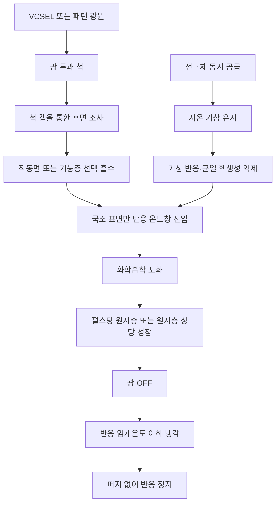
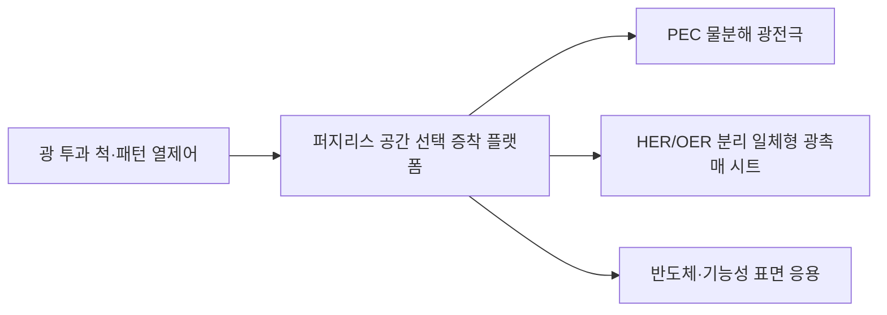

# Cools 퍼지리스 광게이팅 원자층 증착 플랫폼

## 전구체는 함께 둔다. 필요한 표면만, 필요한 위치에서, 필요한 순간에만 활성화한다.

> **종래 원자층 증착은 전구체를 시간적으로 분리한다.**  
> **Cools는 기상 반응을 억제하고 작동면을 광 펄스로 게이팅한다.**

[English](README.md) · [中文](README_ZH.md) · [특허 포트폴리오](PATENT_PORTFOLIO.md)

---

## 핵심 제안

원자층 증착(Atomic Layer Deposition, ALD)은 전구체를 교대로 공급하고 그 사이마다 퍼지하여 자기 제한적 박막 성장을 구현한다. 이 방식은 우수한 두께 제어와 단차 피복성을 제공하지만, 퍼지 구간이 사이클 대부분을 차지하여 처리량의 근본 병목이 된다.

Cools는 자기 제한성을 확보하는 방법을 바꾼다.

1. 둘 이상의 전구체를 동시에 공급한다.
2. 두 전구체가 공존하는 기상을 기상 반응·균일 핵생성·비자기제한적 증착이 억제되는 저온으로 유지한다.
3. 광 투과 척 하부에서 패턴화된 광을 조사한다.
4. 작동면 또는 작동면 위의 흡수층만 선택적으로 가열한다.
5. 광 펄스 동안 화학흡착 포화에 의해 성장을 원자층 수준으로 제한한다.
6. 광을 끄면 작동면이 반응 임계온도 아래로 냉각되어 반응이 정지한다.

결과적으로 **퍼지 없이도 시간·공간적으로 프로그램 가능한 광게이팅 표면 증착 구조**를 구현한다.

---

## 기존 ALD의 구조적 병목

종래 ALD는 두 전구체가 기상에서 만나 화학 기상 증착(Chemical Vapor Deposition, CVD)형 반응으로 전환되는 것을 막기 위해 전구체를 시간적으로 분리한다.

```text
전구체 A
→ 퍼지
→ 전구체 B
→ 퍼지
→ 반복
```

출원문서의 기술 배경에서는 퍼지가 통상 한 사이클의 약 60~80%를 차지하는 것으로 설명한다. Cools는 이 시간분리 구조를 다음 세 요소로 대체한다.

```text
저온 기상
+ 국소 고온 작동면
+ 광 펄스 ON/OFF
= 선택된 표면에서 선택된 시간에만 반응
```

---

## 원천 공정 구조



### 제어축 1 — 기상 반응 억제

챔버 기상은 전구체 간 반응과 균일 핵생성이 실질적으로 억제되는 온도로 유지한다. 콜드월 챔버를 이용하여 벽면과 기상의 온도를 안정화할 수 있다.

### 제어축 2 — 작동면만 활성화

광은 척과 기재를 투과한 뒤 작동면 또는 별도의 광흡수층에서 선택적으로 흡수된다. 선택된 위치만 자기 제한적 표면반응 온도창에 들어간다.

### 제어축 3 — 광 펄스로 반응 종료

광 펄스가 종료되면 해당 영역의 온도가 반응 임계값 아래로 내려간다. 전구체가 계속 공존하더라도 활성 표면 조건이 사라지므로 추가 성장이 억제된다.

---

## 왜 일반 CVD와 다른가

이 플랫폼은 기상 반응 생성물이 연속적으로 침착되는 구조를 목표로 하지 않는다.

자기 제한성의 본체는 다음이다.

- 표면 반응 자리의 포화;
- 광가열된 작동면으로의 반응 위치 제한;
- 펄스 종료 냉각에 의한 반응 시간 제한;
- 저온 기상 유지에 의한 기상 화학 억제.

즉, 종래 ALD의 퍼지 기능을 **온도 공간분리와 광 시간게이팅**으로 대체한다.

---

## 광 투과 정전척과 공간 프로그램형 증착

장치는 광 투과성 정전척(Electrostatic Chuck, ESC), 기재를 지지하는 돌기, 돌기 사이의 광 통과 갭, 그리고 하부의 수직 공진 표면 발광 레이저(Vertical-Cavity Surface-Emitting Laser, VCSEL) 어레이를 포함할 수 있다.

각 emitter의 위치·시점·강도를 독립적으로 제어하면 다음이 가능하다.

```text
전구체는 전면 공급
+ 선택 광픽셀만 가열
= 선택된 영역에만 증착
```

따라서 다음 공정을 생략할 수 있는 구조다.

- 리소그래피 마스크;
- 억제제 층;
- 리프트오프;
- 제품별 고정형 하드마스크.

광 패턴을 바꾸는 것만으로 증착 형상과 영역을 재구성할 수 있다.

---

## 대표 응용 — 광전기화학 물분해

첫 번째 응용군은 광전기화학(Photoelectrochemical, PEC) 물분해 광전극과 일체형 광촉매 시트다.

### 1. 고처리량 광부식 보호층

반도체 광흡수체가 전해질과 직접 접촉하여 광부식되는 것을 막기 위해 산화티타늄, 산화알루미늄, 산화하프늄 등의 핀홀 억제 보호층을 형성한다.

Cools는 ALD의 컨포멀성과 표면 포화 특성을 유지하면서 퍼지 지배 시간을 제거하는 것을 목표로 한다.

### 2. 수소발생·산소발생 조촉매의 마스크리스 분리

수소발생반응(Hydrogen Evolution Reaction, HER) 조촉매와 산소발생반응(Oxygen Evolution Reaction, OER) 조촉매를 동일 작동면의 서로 다른 광 패턴 영역에 형성한다.

```text
HER 전구체 조합 + 광 패턴 A
→ HER 영역

OER 전구체 조합 + 광 패턴 B
→ OER 영역
```

인터디지테이트 패턴 등으로 산화·환원 반응자리를 공간적으로 분리함으로써 전자·정공 재결합과 생성 수소·산소의 역반응을 줄이는 구조다.

### 3. 외부 배선 없는 일체형 반응 시트

제품 구조는 다음을 포함한다.

- 광흡수체;
- 선택적 광부식 보호층;
- 공간 분리된 HER 조촉매 영역;
- 공간 분리된 OER 조촉매 영역.

하나의 시트 면이 외부 배선 없이 물분해 완결 단위로 기능하는 것을 목표로 한다.

---

## 단일 챔버 이종 다층 형성

광 강도와 전구체 조합을 순차적으로 전환하면 작동면을 서로 다른 반응 온도창으로 이동시킬 수 있다.

```text
보호층 전구체
→ 온도창 T1
→ 보호층 형성

조촉매 전구체
→ 온도창 T2
→ 선택영역 조촉매 형성
```

이에 따라 보호층과 조촉매를 단일 챔버에서 순차 적층하고, 웨이퍼 이송·오염·클러스터 툴 부담을 줄일 수 있다.

---

## 부밴드갭 후면 가열

실리콘 기재에는 흡수단보다 긴 파장의 광을 사용하여 벌크를 투과시키고 작동면 또는 기능성 흡수층에서만 선택적으로 열로 전환할 수 있다.

출원문서의 대표 설계예는 다음을 포함한다.

- 실리콘에 대한 약 1500 nm 부밴드갭 광;
- 마이크로초급 펄스폭;
- 작동면 반응온도보다 낮은 기상온도;
- 작동면 근방에 제한된 열확산 길이.

목적은 반도체 벌크·접합·도펀트 프로파일의 열손상을 줄이면서 증착계면만 활성화하는 것이다.

---

## 플랫폼 가치

| 기존 제약 | Cools 대응 |
|---|---|
| 전구체를 반드시 시간분리 | 저온 기상에서 동시 공존 |
| 퍼지가 사이클 대부분을 차지 | 광 펄스가 반응창을 직접 형성 |
| 웨이퍼 또는 챔버 전체 가열 | 작동면만 국소 활성화 |
| 선택증착에 마스크·억제제 필요 | 주소지정 광가열로 영역 정의 |
| 이종막 형성에 장비 간 이송 | 온도창·전구체 전환으로 단일 챔버 적층 |
| 조촉매가 무작위 혼합 | HER/OER 영역을 공간 프로그램 |

---

## 광촉매를 넘어서는 확장축

본체는 물분해 제품이 아니라 박막 증착 아키텍처다. 확장 가능 분야는 다음과 같다.

- 반도체 패시베이션 및 계면층;
- 영역 선택형 유전체·금속 증착;
- 디스플레이 및 센서 기능층;
- 배터리·전기화학 전극 코팅;
- 촉매·전기촉매 패터닝;
- 부식방지 보호막;
- 이산화탄소 환원 광촉매;
- 과산화수소 생성 촉매;
- 공간 프로그램형 다성분·도핑 박막.

각 응용에서는 전구체별 기상 안정성, 표면 포화, 펄스시간, 반응온도창 및 막질을 별도로 검증해야 한다.

---

## 특허 패밀리 구조



본 저장소에 공개하는 두 응용 출원축은 다음이다.

1. 퍼지리스 ALD를 이용한 PEC 광전극 보호층 및 물분해 조촉매 형성;
2. HER/OER 조촉매가 공간 분리된 일체형 광촉매 시트.

상세 구조는 [PATENT_PORTFOLIO.md](PATENT_PORTFOLIO.md)에 정리했다.

---

## 검증 로드맵

1. 저온 기상에서 상호반응이 충분히 억제되는 전구체 조합 선별;
2. 표면반응 임계온도 및 광흡수층 확립;
3. 펄스별 성장 포화 거동 확인;
4. 종래 ALD·연속 CVD와 성장량 비교;
5. 막두께 균일도·조성·컨포멀성·핀홀 밀도 측정;
6. 광 패턴 해상도와 경계 전이폭 평가;
7. 전해질 내 보호층 내구성 검증;
8. HER/OER 공간분리에 따른 재결합·역반응 저감 검증.

문서의 수치 범위는 발명 설계예와 공정창이며, 완료된 독립 실험결과를 의미하지 않는다.

---

## 협력 범위

- 광 투과 척 및 챔버 공동개발;
- VCSEL 어레이와 광 패턴 제어;
- 전구체 스크리닝과 반응창 규명;
- 퍼지리스 ALD 실증;
- PEC 광전극·광촉매 시트 제작;
- 반도체·전기화학 응용개발;
- 장비 라이선스;
- 응용분야별 기술 라이선스.

---

## 고지

본 저장소는 특허 기반 기술 플랫폼을 공개 설명 수준으로 정리한 것이다. 공개는 기술 사용허락을 의미하지 않으며, 세부 레시피·표면 전처리·전구체 관리·제어 로직·장비 통합 노하우는 별도 기술 및 사업 협의 대상이다.

**㈜쿨스 — 반도체 공정·광 열제어·계면공학 플랫폼**
