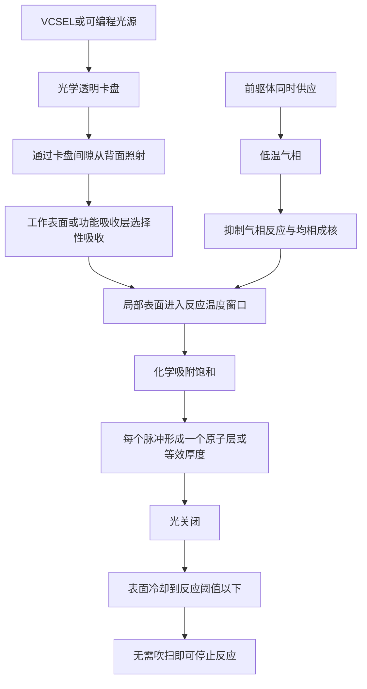
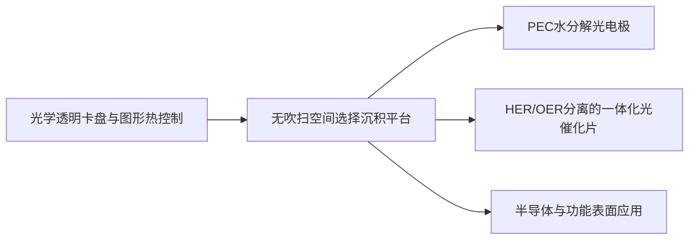

# Cools 无吹扫光门控原子层沉积平台

## 前驱体保持共存，只在需要的位置、需要的表面、需要的时刻激活反应。

> **传统原子层沉积通过时间分离前驱体。**  
> **Cools 通过抑制气相反应并以光脉冲门控工作表面来实现选择性反应。**

[English](README.md) · [한국어](README_KR.md) · [专利组合](PATENT_PORTFOLIO.md)

---

## 核心主张

原子层沉积（Atomic Layer Deposition, ALD）通常通过交替供应前驱体并在其间进行吹扫，维持自限性表面反应。该方法具备优异的厚度控制和台阶覆盖能力，但吹扫阶段往往占据每个循环的大部分时间，成为吞吐量的根本瓶颈。

Cools 改变了自限性控制方式。

1. 两种或更多前驱体同时供应；
2. 使共存前驱体的气相保持在抑制气相反应、均相成核和非自限性沉积的低温；
3. 从透明卡盘下方照射可编程光脉冲；
4. 仅加热工作表面或其上的吸收层；
5. 通过化学吸附饱和将每个脉冲的生长限制在原子层或原子层等效厚度；
6. 关闭光脉冲后，使激活区域冷却到反应阈值以下，从而停止反应。

由此形成一个专利申请支持的 **无吹扫、空间可编程、光门控表面沉积平台**。

---

## 传统 ALD 的结构性矛盾

传统 ALD 通过时间分离两种前驱体，避免其在气相中直接反应并转化为化学气相沉积（Chemical Vapor Deposition, CVD）式连续生长。

```text
前驱体 A
→ 吹扫
→ 前驱体 B
→ 吹扫
→ 重复
```

专利文件的技术背景指出，吹扫通常可占一个循环的约 60–80%。Cools 以三个协调控制轴替代这种时间分离。

```text
低温气相
+ 局部高温工作表面
+ 光脉冲 ON/OFF
= 仅在选定位置和选定时间发生反应
```

---

## 核心工艺架构



### 控制轴 1 — 抑制气相反应

腔体气相维持在前驱体之间的直接反应、均相成核和连续非自限性沉积受到实质抑制的温度。冷壁腔体可用于稳定该条件。

### 控制轴 2 — 只激活工作表面

光通过卡盘和基体，在工作表面或专门设计的吸收层中选择性吸收。只有被选中的区域进入自限性表面反应温度窗口。

### 控制轴 3 — 以光脉冲终止反应

光脉冲结束后，激活区域降到反应阈值以下。即使前驱体继续共存，表面激活条件消失，额外生长也被抑制。

---

## 为什么它不是普通 CVD

该平台并非依赖气相反应产物的连续沉积。

目标自限机制包括：

- 表面反应位点饱和；
- 将反应限制在光加热工作表面；
- 通过脉冲关闭和冷却限制反应时间；
- 通过低温气相抑制气相化学反应。

因此，本平台以 **温度空间分离和光时间门控** 取代传统 ALD 中的吹扫功能。

---

## 光学透明静电卡盘与空间可编程沉积

设备可包括光学透明静电卡盘（Electrostatic Chuck, ESC）、支撑工件的凸点、凸点之间的光通道，以及位于下方的垂直腔面发射激光器（Vertical-Cavity Surface-Emitting Laser, VCSEL）阵列。

每个发射单元的位置、时序和强度均可独立控制。

```text
整个表面暴露于前驱体
+ 只点亮选定光像素
= 只在选定加热区域沉积
```

由此可减少或消除：

- 光刻掩膜；
- 抑制剂层；
- 剥离工艺；
- 为每种图形准备固定硬掩膜。

只需修改光图形，即可重构沉积区域的形状和分布。

---

## 代表性应用 — 光电化学水分解

首个应用族包括光电化学（Photoelectrochemical, PEC）水分解光电极和一体化光催化片。

### 1. 高吞吐量、低针孔光腐蚀保护层

可在半导体光吸收体上形成二氧化钛、氧化铝、氧化铪等致密保护层，以隔离电解液并降低光腐蚀。

本平台旨在保留 ALD 的共形性和表面饱和特征，同时消除由吹扫主导的循环时间。

### 2. 无掩膜分离 HER/OER 助催化剂

在同一工作表面的不同光图形区域形成析氢反应（Hydrogen Evolution Reaction, HER）和析氧反应（Oxygen Evolution Reaction, OER）助催化剂。

```text
HER 前驱体组合 + 光图形 A
→ HER 区域

OER 前驱体组合 + 光图形 B
→ OER 区域
```

采用交指状或其他空间分离图形，可将氧化与还原反应位点分开，从而降低电子—空穴复合以及生成氢氧之间的逆反应。

### 3. 无外部布线的一体化反应片

该结构可包括：

- 光吸收体；
- 可选的低针孔光腐蚀保护层；
- 空间分离的 HER 助催化剂区域；
- 空间分离的 OER 助催化剂区域。

目标是使单个片材表面在无外部布线的情况下成为完整水分解单元。

---

## 单腔体异质多层形成

通过依次切换光强和前驱体组合，可使工作表面在不同反应温度窗口之间切换。

```text
保护层前驱体
→ 温度窗口 T1
→ 形成保护层

助催化剂前驱体
→ 温度窗口 T2
→ 形成图形化助催化剂
```

因此，保护层和助催化剂可在同一腔体内连续形成，从而减少晶圆搬运、污染暴露和集群设备复杂度。

---

## 亚带隙背面加热

对于硅基工件，可使用长于硅吸收边的光，使其穿过主体并在工作表面或功能吸收层中选择性转化为热。

专利实施例包括：

- 对硅使用约 1500 nm 亚带隙光；
- 微秒级脉冲宽度；
- 低于表面反应温度的气相温度；
- 局限于工作表面附近的热扩散长度。

其目的是激活沉积界面，同时降低半导体主体、结区和掺杂分布的热损伤。

---

## 平台价值

| 传统约束 | Cools 平台响应 |
|---|---|
| 前驱体必须时间分离 | 在低温气相中可同时共存 |
| 吹扫占据大部分循环时间 | 光脉冲直接建立反应时间窗口 |
| 加热整个晶圆或腔体 | 只激活工作表面 |
| 区域选择 ALD 依赖掩膜或抑制剂 | 通过可寻址光加热定义区域 |
| 多种材料需要设备间转移 | 切换温度窗口与前驱体实现单腔体顺序沉积 |
| 助催化剂随机混合 | HER/OER 区域可空间编程 |

---

## 超越光催化的扩展方向

核心发明是沉积架构，而非单一水分解产品。潜在扩展包括：

- 半导体钝化层与界面层；
- 区域选择性介电层和金属沉积；
- 显示与传感器功能层；
- 电池与电化学电极涂层；
- 催化剂与电催化剂图形化；
- 防腐蚀保护膜；
- 二氧化碳还原光催化剂；
- 过氧化氢生成催化剂；
- 空间可编程多组分或掺杂薄膜。

每项应用都需要针对特定前驱体验证气相稳定性、表面饱和、脉冲持续时间、热窗口和膜质量。

---

## 专利族结构



本仓库公开说明的两个应用申请轴包括：

1. 利用无吹扫 ALD 形成 PEC 光电极保护层和水分解助催化剂；
2. 具有空间分离 HER/OER 助催化剂区域的一体化光催化片。

详见 [PATENT_PORTFOLIO.md](PATENT_PORTFOLIO.md)。

---

## 验证路线

1. 筛选在低温气相中相互反应受到充分抑制的前驱体组合；
2. 建立表面反应阈值和光吸收层；
3. 证明逐脉冲生长饱和行为；
4. 与传统 ALD 和连续 CVD 比较每脉冲生长量；
5. 测量厚度均匀性、成分、共形性和针孔密度；
6. 评估光图形分辨率和边界过渡宽度；
7. 验证电解液中的保护层耐久性；
8. 测量 HER/OER 空间分离对复合和逆反应的抑制效果。

专利文件中的数值范围属于工程实施例和设计窗口，并不代表已完成独立工艺验证。

---

## 合作范围

- 光学透明卡盘与腔体共同开发；
- VCSEL 阵列与光图形控制；
- 前驱体筛选和反应窗口表征；
- 无吹扫 ALD 工艺验证；
- PEC 光电极和光催化片制造；
- 半导体与电化学应用；
- 设备许可；
- 面向具体应用领域的技术许可。

---

## 声明

本仓库以公开说明级别介绍专利支持的技术平台。公开内容不构成许可，也不披露全部实施诀窍。详细配方、表面预处理、前驱体管理、控制逻辑和设备集成方案需另行进行技术与商业协商。

**Cools Inc. — 半导体工艺、光热控制与界面工程平台**
